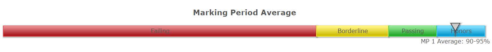
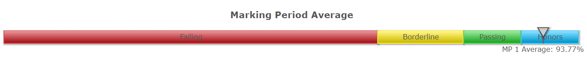

# pupilpath-real-grade
A tampermonkey script that shows you your exact grade for classes that have it disabled.

# Installation
1. Install [Tampermonkey](https://tampermonkey.net/)
2. Create a new userscript on the Tampermonkey dashboard and paste the contents of [script.js](script.js)

# Usage
### Before

### After

